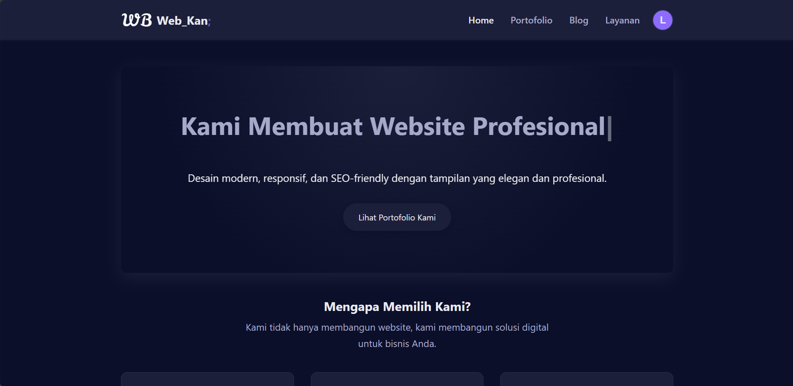

# Web_Kan; - Website Jasa Pembuatan Website (Full-Stack)

Ini adalah *website* portofolio *full-stack* profesional untuk agensi/freelancer "Web_Kan". Proyek ini dibangun sepenuhnya menggunakan **Django** untuk *backend* dan **JavaScript** modern untuk *frontend* yang dinamis.

*Website* ini tidak hanya statis, tetapi juga dilengkapi dengan sistem otentikasi (Login with Google), *dashboard* klien, dan panel admin yang dikustomisasi.



---

## 🚀 Fitur Utama

### Frontend & UI/UX
* **Tema Gelap Modern:** Desain yang halus, konsisten, dan profesional dengan palet warna ungu-biru tua.
* **Desain Responsif:** Tampilan yang dioptimalkan untuk *desktop*, *tablet*, dan *mobile*.
* **Efek Ketik (Typed.js):** *Hero section* dinamis dengan animasi teks mengetik untuk menarik perhatian.
* **Animasi Scroll (Fade-in):** Semua *section* di halaman *home* muncul secara perlahan saat di-*scroll*.
* **Navbar Canggih:**
    * Logo kustom dengan efek gradasi dan berdenyut.
    * Menu *hamburger* di tampilan *mobile*.
    * Logika *login* yang dinamis: menampilkan tombol "Login" atau *dropdown* profil pengguna.

### Backend & Fungsionalitas
* **CMS Penuh (via Admin):**
    * **Portofolio Dinamis:** Admin dapat menambah, mengedit, dan menghapus proyek portofolio kapan saja.
    * **Blog Dinamis:** Admin dapat mempublikasikan artikel (dengan format HTML) melalui panel admin.
* **Formulir Kontak:**
    * Mengirim notifikasi **email** secara otomatis ke admin saat ada pesan baru.
    * Formulir "pintar" yang otomatis terisi jika *user* datang dari halaman Layanan.
    * Formulir otomatis terisi data *user* (nama & email) jika *user* sudah *login*.

### Sistem Otentikasi & Klien (django-allauth)
* **Login Google (OAuth2):** Sistem *login* dan *signup* yang aman hanya menggunakan akun Google.
* **Dashboard Klien:** Halaman "Kontrak Saya" yang dilindungi *login* (`@login_required`).
* **Manajemen Kontrak:**
    * Klien dapat melihat status proyek mereka (*Menunggu*, *Dikerjakan*, *Selesai*).
    * Status diwarnai sesuai tahapan (Kuning, Biru, Hijau) untuk visualisasi yang jelas.
* **Dropdown Profil:** Setelah *login*, *user* mendapatkan menu *dropdown* kustom dengan foto profil Google mereka, link ke kontrak, dan tombol *logout*.

### Panel Admin (Kustom)
* **Link Admin Cepat:** *Dropdown* profil admin (`is_staff`) memiliki link "Halaman Admin" untuk akses cepat.
* **Tampilan Kontrak yang Dioptimalkan:**
    * Menampilkan **Email Klien** di daftar (bukan *username*).
    * Status kontrak dapat diedit langsung dari halaman daftar.
* **Formulir Kontrak Canggih:** Menggunakan **`autocomplete_fields`** untuk mencari dan memilih *user* dengan mudah saat membuat kontrak baru.

---

## 🛠️ Teknologi yang Digunakan

* **Backend:** Python 3.13, Django
* **Server:** Gunicorn (untuk produksi)
* **Database:** PostgreSQL (untuk produksi), SQLite3 (untuk lokal)
* **Frontend:** HTML5, CSS3, JavaScript (Vanilla)
* **Otentikasi:** `django-allauth`
* **Library Python:** `django-dotenv`, `dj-database-url`, `whitenoise`, `psycopg2-binary`
* **Library JS:** `Typed.js` (untuk efek ketik)

---

## ⚙️ Instalasi & Menjalankan di Lokal

Untuk menjalankan proyek ini di komputer Anda:

1.  **Clone repositori:**
    ```bash
    git clone https://github.com/Laluarkan/jasaWeb.git
    cd nama-repo-anda
    ```

2.  **Buat & aktifkan *virtual environment*:**
    ```bash
    python -m venv env
    .\env\Scripts\activate
    ```
    *(Gunakan `source env/bin/activate` untuk macOS/Linux)*

3.  **Install semua *library*:**
    ```bash
    pip install -r requirements.txt
    ```

4.  **Buat file `.env`:**
    Buat file bernama `.env` di folder utama (sejajar `manage.py`). File ini **wajib** ada.

    ```dotenv
    # Kunci rahasia Django (Anda bisa buat yang baru)
    SECRET_KEY=django-insecure-!y0(q6$e-#9cvs7agtr!964=20j(^xu#&hm(5(10h@-$so*i-u
    
    # Kredensial Email (Gunakan App Password dari Google)
    EMAIL_USER=email-admin-anda@gmail.com
    EMAIL_PASS=password16digitdari_google
    
    # DATABASE_URL (Kosongkan untuk mode lokal agar SQLite aktif)
    # DATABASE_URL=
    ```

5.  **Jalankan Migrasi Database:**
    (Ini akan membuat file `db.sqlite3` Anda)
    ```bash
    python manage.py migrate
    ```

6.  **Buat Superuser (Admin):**
    ```bash
    python manage.py createsuperuser
    ```

7.  **Jalankan Server Lokal:**
    ```bash
    python manage.py runserver
    ```
    Buka `http://127.0.0.1:8000/` di *browser* Anda.

8.  **(Opsional) Setup Login Google Lokal:**
    * Pergi ke Google Cloud Console dan buat Kredensial OAuth2.
    * Tambahkan `http://127.0.0.1:8000` sebagai *Authorized JavaScript origin*.
    * Tambahkan `http://127.0.0.1:8000/accounts/google/login/callback/` sebagai *Authorized redirect URI*.
    * Masuk ke Admin Django (`/admin/`), pergi ke **Social Applications**, dan tambahkan **Client ID** serta **Secret Key** Anda.

---

## 🚀 Konfigurasi Deployment

Proyek ini sudah dikonfigurasi untuk *deployment* (misal: di Render, Railway, atau Heroku).

* **Pengaturan Cerdas:** File `settings.py` secara otomatis mendeteksi jika `DATABASE_URL` ada.
    * **Jika ada:** Masuk ke **Mode Produksi** (PostgreSQL, `DEBUG=False`).
    * **Jika tidak ada:** Masuk ke **Mode Lokal** (SQLite, `DEBUG=True`).
* **File Statis:** Menggunakan `Whitenoise` untuk menyajikan file CSS/JS di produksi.
* **File Konfigurasi:**
    * `requirements.txt`: Daftar paket Python.
    * `Procfile`: Perintah `gunicorn` untuk server.
    * `runtime.txt`: Menentukan versi Python.